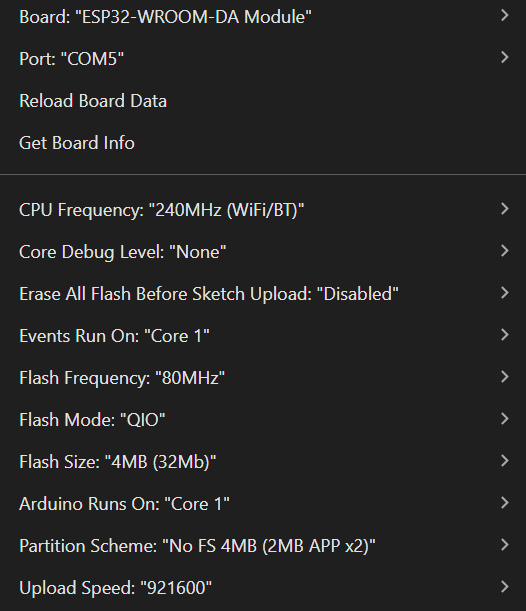

# ESP32 Google Maps, Non-BLE, OLED screen with AdafruitGFX library

This is the old version of [esp32-google-maps](https://github.com/maisonsmd/esp32-google-maps).

Since many of you asked for more common OLED display, I just dig out this old code and publish it here.

## Difference between this and the new version

- This version uses AdafruitGFX library, instead of `lvgl` library. You can change the OLED display to any other AdafruitGFX compatible display.
- This version does not use BLE (since I don't have one with BLE support at the time of writing this code). It uses Bluetooth Classic instead.
- The font supports English characters with some of Vietnamese characters, since making fonts for AdafruitGFX is a bit more complicated than `lvgl` library. There are some workarounds in the Android app code for the font issues.

The OLED display is kind of small, the text is even smaller, mine is 0.96 inch, if you can find a bigger one, it will be better.

I will merge this code into the new version later when I have time, there will be one Android app for multiple display types.

## Display wiring

| OLED Pin | ESP32 Pin |
|----------|-----------|
| VCC      | 3.3V      |
| GND      | GND       |
| SCL      | GPIO 22   |
| SDA      | GPIO 21   |

## Arduino configuration

## Prebuilt binary

Check the `binaries` folder for the prebuilt binary.

For the Android app, you have to build it yourself and install to your phone via Android Studio, Play Protect won't allow you to install the prebuilt APK anymore. 